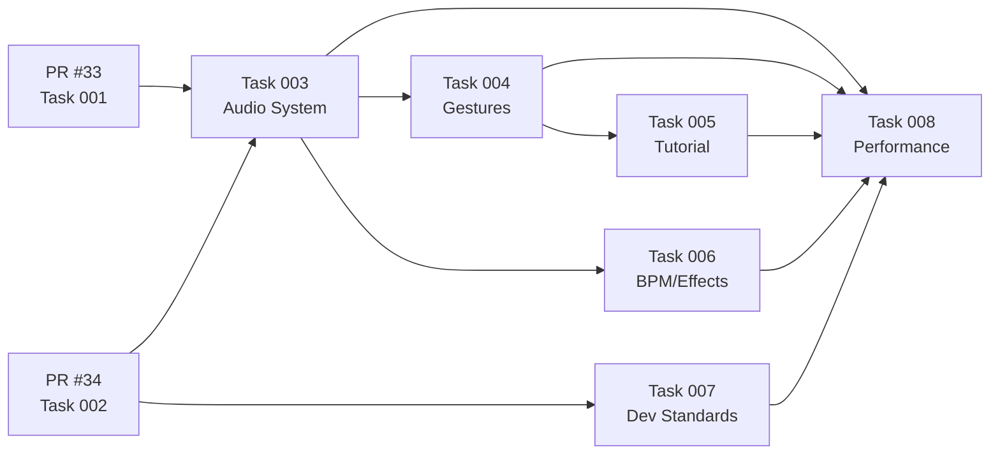

# Execution Status

## Current State
- **PR #33** (Task 001: Fix Critical Browser Errors) - OPEN, MERGEABLE
- **PR #34** (Task 002: Refactor Page Architecture) - OPEN, MERGEABLE

## Blocked Tasks (Waiting for PR Merges)

### Ready After PR #33 & #34 Merge:
- **Task 003**: Complete Audio System (8 hours)
  - Depends on: 001, 002
  - Parallel: false

- **Task 007**: Setup Development Standards (3 hours)
  - Depends on: 002
  - Parallel: true

### Ready After Task 003 Completes:
- **Task 004**: Wire Gesture Controls (4 hours)
  - Depends on: 002, 003
  - Parallel: false

- **Task 006**: Add BPM and Effects (4 hours)
  - Depends on: 003
  - Parallel: true

### Ready After Task 004 Completes:
- **Task 005**: Implement Tutorial System (5 hours)
  - Depends on: 004
  - Parallel: true

### Final Task:
- **Task 008**: Performance and Accessibility (6 hours)
  - Depends on: ALL (001-007)
  - Parallel: false

## Optimal Execution Plan

## Active Agents
- None currently (waiting for PR merges)

## Queued Work
1. Analyze Task 003 (Complete Audio System) for parallel streams
2. Analyze Task 007 (Setup Development Standards) for parallel streams
3. Prepare agent launches once PRs merge

## Completed
- Task 001: Fix Critical Browser Errors (PR #33 submitted)
- Task 002: Refactor Page Architecture (PR #34 submitted)

## Next Actions
1. Wait for PR #33 and #34 to be merged
2. Once merged, pull changes to worktree
3. Launch parallel agents for Tasks 003 and 007
4. Monitor progress and coordinate subsequent tasks