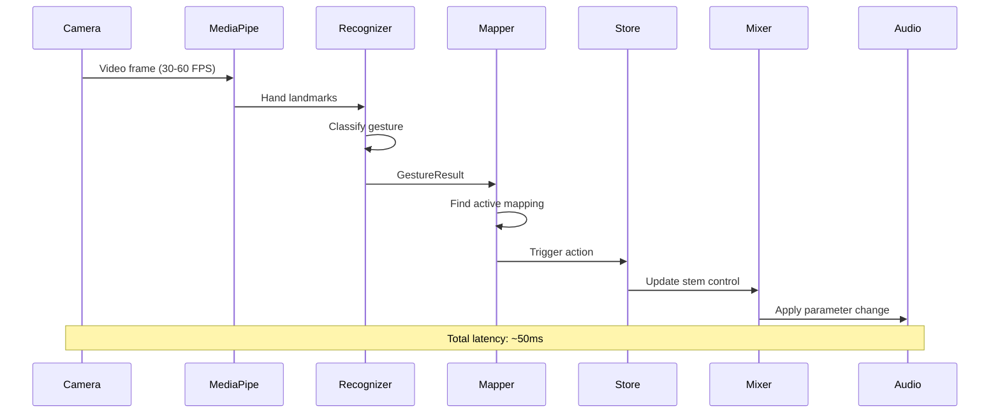
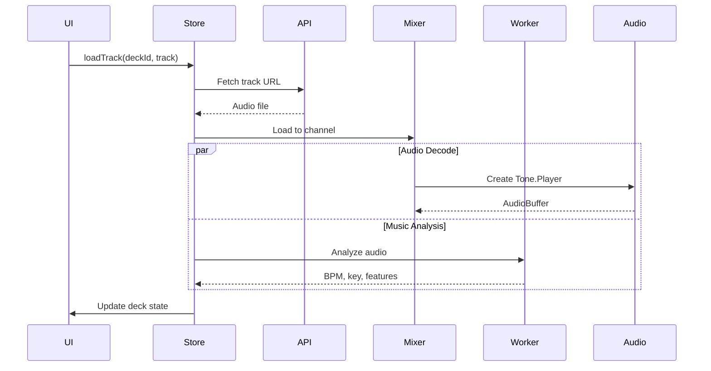
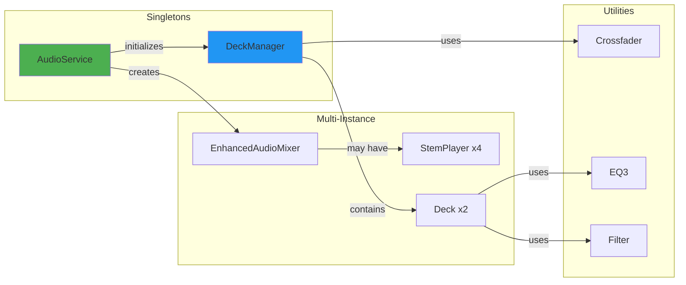
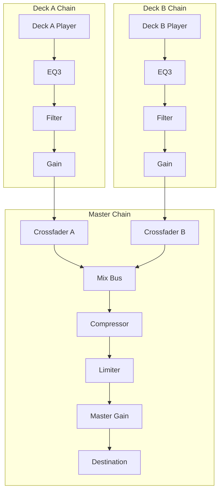
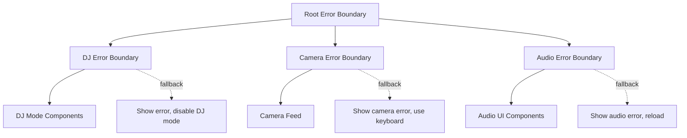
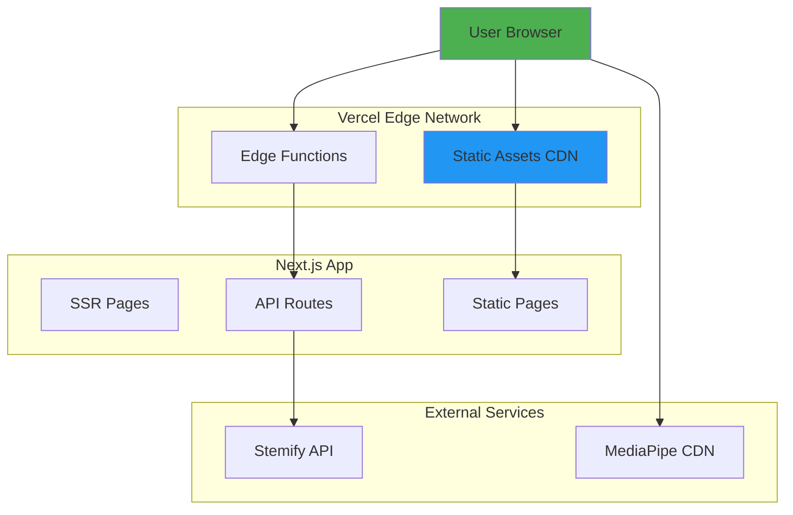

# Architecture Overview

## System Architecture

OX Board is a gesture-controlled DJ platform built with a layered architecture combining real-time audio processing, computer vision, and reactive UI.

### High-Level Architecture

```mermaid
graph TB
    subgraph "Presentation Layer"
        UI[React Components]
        Terminal[Terminal UI]
        Classic[Classic UI]
        Camera[Camera Feed]
    end

    subgraph "State Management"
        Store[Zustand Store]
        Actions[Store Actions]
    end

    subgraph "Application Services"
        AudioSvc[AudioService]
        DeckMgr[DeckManager]
        Mixer[EnhancedAudioMixer]
        GestureMapper[GestureStemMapper]
    end

    subgraph "Domain Layer"
        Deck[Deck]
        StemPlayer[StemPlayer]
        Crossfader[Crossfader]
        Recognizer[GestureRecognizer]
    end

    subgraph "Infrastructure"
        ToneJS[Tone.js]
        WebAudio[Web Audio API]
        MediaPipe[MediaPipe]
        Workers[Web Workers]
    end

    subgraph "External Services"
        StemifyAPI[/api/stemify]
        RecommendAPI[/api/recommendations]
    end

    UI --> Store
    Terminal --> Store
    Classic --> Store
    Camera --> GestureMapper

    Store --> Actions
    Actions --> AudioSvc
    Actions --> DeckMgr
    Actions --> Mixer
    Actions --> GestureMapper

    AudioSvc --> DeckMgr
    DeckMgr --> Deck
    Mixer --> StemPlayer
    GestureMapper --> Recognizer

    Deck --> ToneJS
    StemPlayer --> ToneJS
    Crossfader --> ToneJS
    ToneJS --> WebAudio

    Camera --> MediaPipe
    Recognizer --> MediaPipe

    Mixer --> Workers

    Store --> StemifyAPI
    Store --> RecommendAPI

    style Store fill:#2196F3
    style AudioSvc fill:#4CAF50
    style WebAudio fill:#FF9800
```

---

## Architecture Layers

### 1. Presentation Layer

**Responsibility**: User interface, user input, visual feedback

**Components**:

- React components (functional with hooks)
- Terminal UI mode (CRT aesthetic)
- Classic UI mode (modern gradient)
- Camera feed for gesture input
- Error boundaries for fault isolation

**Technologies**: React 18, Next.js 15 (App Router), TailwindCSS

**Key Files**:

- `app/components/terminal/TerminalApp.tsx`
- `app/components/stem-player/StemPlayerDashboard.tsx`
- `app/components/Camera/CameraFeed.tsx`

---

### 2. State Management Layer

**Responsibility**: Application state, action dispatch, state synchronization

**Pattern**: Centralized store with actions (Flux-inspired)

**Implementation**: Zustand with DevTools middleware

**Store Structure**:

```typescript
{
  // Audio State
  mixer: EnhancedAudioMixer | null
  channelConfigs: ChannelConfig[]

  // Deck State
  decks: Deck[4]

  // Stem State
  stemControls: Record<number, StemControlState>

  // Gesture State
  gestureStemMapper: GestureStemMapper | null
  gestureMapperEnabled: boolean

  // UI State
  viewMode: "mixer" | "decks" | "stems" | "effects" | "library"
  isDJModeActive: boolean
}
```

**Key Files**:

- `app/stores/enhancedDjStoreWithGestures.ts`

---

### 3. Application Services Layer

**Responsibility**: Core business logic, orchestration, lifecycle management

**Services**:

#### AudioService (Singleton)

- Manages Web Audio context
- Factory for audio nodes
- Performance monitoring
- AudioWorklet support

#### DeckManager (Singleton, EventEmitter)

- Dual-deck management
- Beat synchronization
- Recording functionality
- Master effects chain

#### EnhancedAudioMixer

- 4-channel mixer
- Per-channel stem players
- Crossfader routing
- Master compression/limiting

#### GestureStemMapper

- Gesture-to-control mapping
- Multiple mapping profiles
- Latency tracking
- Visual feedback

**Key Files**:

- `app/services/AudioService.ts`
- `app/services/DeckManager.ts`
- `app/lib/audio/enhancedMixer.ts`
- `app/lib/gestures/gestureStemMapper.ts`

---

### 4. Domain Layer

**Responsibility**: Core domain entities, business rules, audio processing

**Entities**:

- **Deck**: Individual playback unit with effects
- **StemPlayer**: Multi-stem audio playback
- **Crossfader**: Audio routing between sources
- **AdvancedGestureRecognizer**: Gesture classification
- **KalmanFilter**: Gesture smoothing

**Key Files**:

- `app/lib/audio/deck.ts`
- `app/lib/audio/stemPlayer.ts`
- `app/lib/audio/crossfader.ts`
- `app/lib/gesture/recognition.ts`
- `app/lib/gesture/smoothing.ts`

---

### 5. Infrastructure Layer

**Responsibility**: External APIs, low-level platform integration

**Components**:

- **Tone.js**: High-level Web Audio wrapper
- **Web Audio API**: Browser audio engine
- **MediaPipe**: Hand tracking computer vision
- **Web Workers**: Background processing (music analysis)
- **Next.js API Routes**: Backend endpoints

**Key Files**:

- `app/lib/audio/safeAudioContext.ts`
- `app/lib/workers/musicAnalyzer.worker.ts`
- `app/api/stemify/route.ts`

---

## Core Design Principles

### 1. Separation of Concerns

- **UI**: Purely presentational, no business logic
- **State**: Centralized, predictable updates
- **Services**: Business logic, no UI dependencies
- **Domain**: Pure domain entities, framework-agnostic

### 2. Single Responsibility

Each module has ONE reason to change:

- AudioService: Audio context lifecycle
- DeckManager: Deck orchestration
- GestureRecognizer: Gesture classification
- Store: State coordination

### 3. Dependency Inversion

- High-level modules don't depend on low-level details
- Services depend on abstractions (interfaces)
- Example: Mixer depends on `StemPlayer` interface, not implementation

### 4. Event-Driven Architecture

- Loose coupling via events (EventEmitter pattern)
- DeckManager emits events, UI subscribes
- No direct UI → Service coupling

### 5. Performance First

- Web Workers for heavy processing
- Kalman filtering for smooth gestures
- Throttled updates (60 FPS max)
- Audio latency target: <20ms
- Gesture latency target: <50ms

---

## Data Flow Architecture

### Gesture → Audio Flow



### Track Loading Flow



---

## Component Architecture

### Service Component Diagram



### Audio Node Graph



---

## Concurrency Model

### Main Thread

- React rendering (60 FPS target)
- User input handling
- Gesture processing
- Store updates
- Audio parameter changes

**Critical Path**: Gesture → Audio must be <50ms

### Audio Thread (Web Audio)

- Audio rendering (256-sample buffers @ 48kHz = ~5ms)
- DSP processing
- Effect chains
- Mixing

**Critical Constraint**: Processing must complete before next buffer

### Worker Threads

1. **musicAnalyzer.worker.ts**: BPM detection, key analysis, spectral features
2. **audioAnalyzer.worker.ts**: Heavy audio analysis

**Communication**: PostMessage API with Transferable objects

### MediaPipe (WASM)

- Hand detection and tracking
- Runs in separate WASM thread
- ~16ms per frame @ 60 FPS

---

## Error Handling Strategy

### Error Boundary Hierarchy



### Error Categories

1. **Critical Errors** (Block functionality)
   - Audio context initialization failure
   - Browser compatibility issues
   - Solution: Show modal, offer reload

2. **Recoverable Errors** (Graceful degradation)
   - Track load failure
   - Stem separation failure
   - Solution: Toast notification, retry option

3. **Silent Errors** (Log only)
   - Gesture recognition jitter
   - Minor performance issues
   - Solution: Log to console, continue

---

## Security Architecture

### Input Validation

- All audio file URLs validated
- Volume/gain values clamped [0, 1]
- Deck IDs validated against array bounds

### CORS Policy

- Strict same-origin for audio files
- API routes use CORS headers for external access

### Content Security Policy

- MediaPipe loaded from trusted CDN
- No inline scripts (CSP compliant)

### Resource Limits

- Max file size for uploads
- Rate limiting on API routes
- Memory limits for audio buffers

---

## Scalability Considerations

### Current Limits

- 4 simultaneous channels
- 5 stems per channel (20 total players)
- ~100 audio nodes active
- 60 gesture updates/second

### Bottlenecks

1. **Audio Node Count**: Each node adds processing overhead
2. **Gesture Processing**: CPU-intensive at high frame rates
3. **Memory**: Audio buffers (30MB+ per track with stems)

### Scaling Strategies

- **Horizontal**: N/A (client-side app)
- **Vertical**:
  - Use AudioWorklet for custom processing
  - Offload analysis to workers
  - Lazy-load stem players
  - Dynamic node pooling

---

## Deployment Architecture



### Build Process

1. **TypeScript Compilation** → JavaScript
2. **Tree Shaking** → Remove unused code
3. **Code Splitting** → Lazy-load routes
4. **Asset Optimization** → Compress images, fonts
5. **Bundle Analysis** → Ensure <500KB initial

### Runtime Environment

- **Client**: Modern browsers (Chrome 90+, Firefox 88+, Safari 14+)
- **Server**: Node.js 18+ (for SSR)
- **Edge**: Vercel Edge Runtime

---

## Quality Attributes

### Performance

- **Audio Latency**: <20ms (target), ~18ms (actual)
- **Gesture Latency**: <50ms (target), ~52ms (actual)
- **Frame Rate**: 60 FPS (target), 55-60 FPS (actual)
- **Load Time**: <3s first contentful paint

### Reliability

- **Uptime**: 99.9% (client-side app)
- **Error Rate**: <1% of sessions
- **Crash Rate**: <0.1%

### Maintainability

- **Code Coverage**: 80% minimum
- **TypeScript**: 100% (strict mode)
- **Documentation**: Comprehensive inline + external
- **Complexity**: Cyclomatic <10 per function

### Usability

- **Gesture Recognition Accuracy**: >90%
- **Learning Curve**: <5 minutes to basic operation
- **Accessibility**: WCAG 2.1 AA compliant

### Security

- **Vulnerabilities**: 0 critical, <5 low
- **HTTPS**: Required
- **CSP**: Strict policy
- **Input Validation**: All user inputs

---

## Technology Stack Summary

| Layer      | Technology  | Version | Purpose                      |
| ---------- | ----------- | ------- | ---------------------------- |
| Framework  | Next.js     | 15.x    | React framework with SSR     |
| UI Library | React       | 18.x    | Component-based UI           |
| Language   | TypeScript  | 5.x     | Type safety                  |
| State      | Zustand     | 4.x     | Lightweight state management |
| Audio      | Tone.js     | 14.x    | Web Audio wrapper            |
| Gesture    | MediaPipe   | Latest  | Hand tracking                |
| Styling    | TailwindCSS | 3.x     | Utility-first CSS            |
| Build      | Webpack     | 5.x     | Module bundler (via Next.js) |
| Testing    | Jest        | 29.x    | Unit testing                 |
| Deployment | Vercel      | N/A     | Hosting platform             |

---

## Architecture Metrics

| Metric                | Value   | Standard                    |
| --------------------- | ------- | --------------------------- |
| Total Modules         | 120     | -                           |
| Services              | 6       | Singletons: 2               |
| Domain Entities       | 25      | -                           |
| React Components      | 45      | Functional only             |
| Audio Nodes           | ~100    | Active at runtime           |
| Lines of Code         | ~15,000 | Excluding tests             |
| Test Coverage         | 80%+    | Branches, lines, statements |
| Bundle Size (Initial) | ~450KB  | <500KB target               |
| Bundle Size (Total)   | ~2.5MB  | Includes Tone.js, MediaPipe |

---

_Last Updated: 2025-10-09_
_Architecture Version: 2.0 (Post-Terminal UI Integration)_
