# Entity Relationships

## Overview

This document maps relationships between entities in the OX Board system using entity-relationship diagrams.

---

## Core Audio Engine Relationships

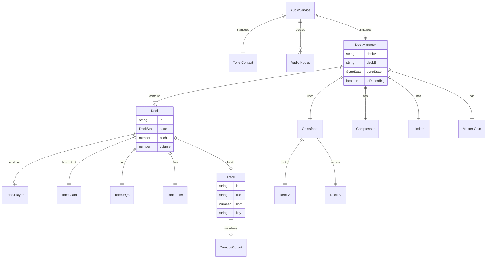

---

## Stem Processing Relationships

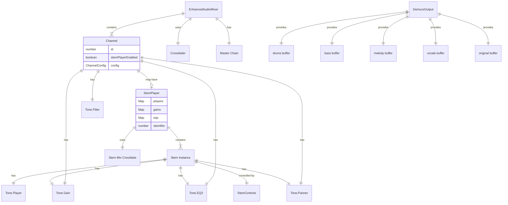

---

## Gesture Recognition Relationships

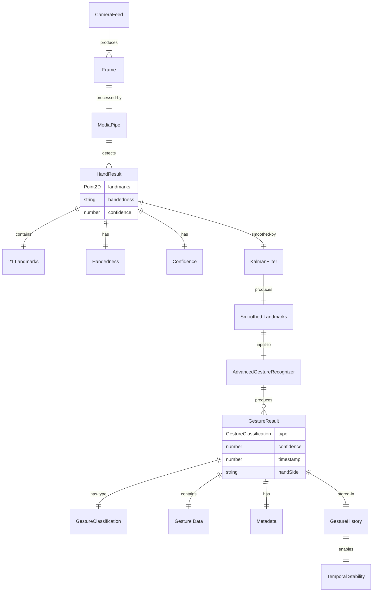

---

## Gesture Mapping Relationships

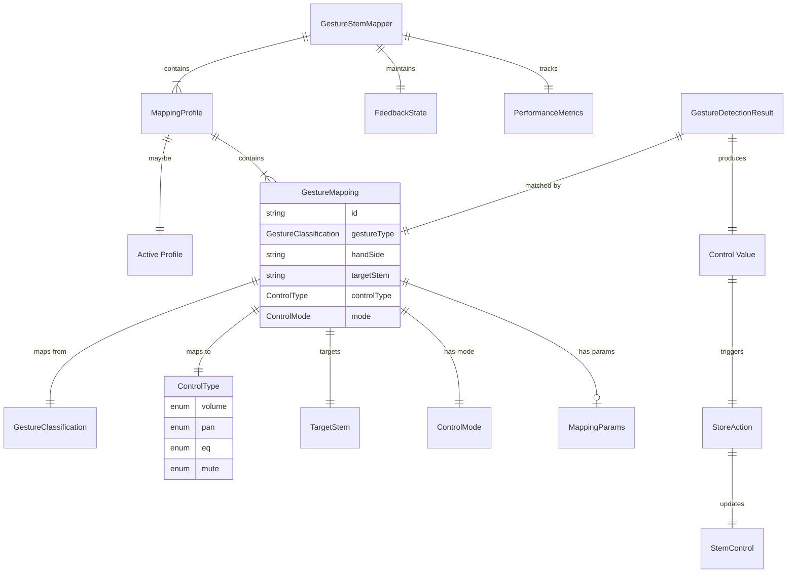

---

## State Management Relationships

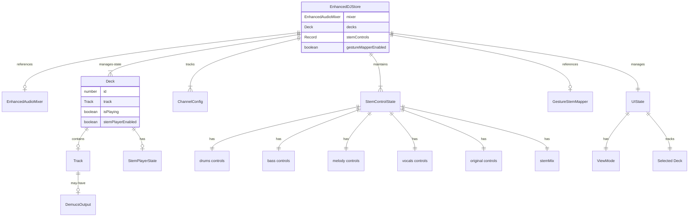

---

## Music Analysis Relationships

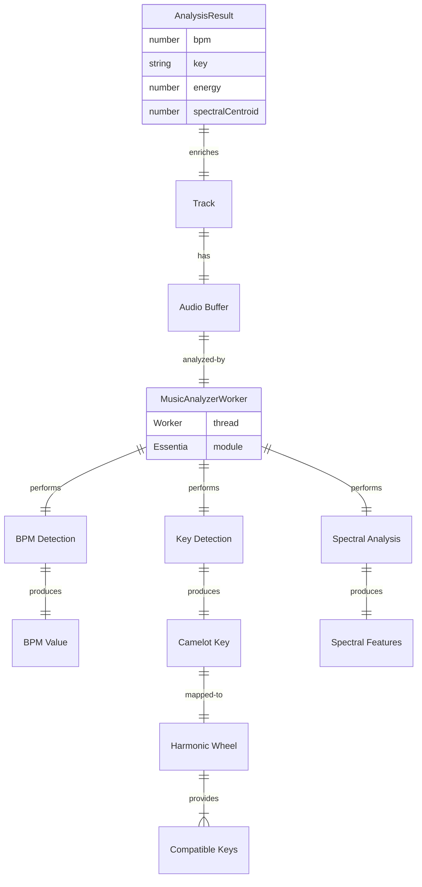

---

## Performance Monitoring Relationships

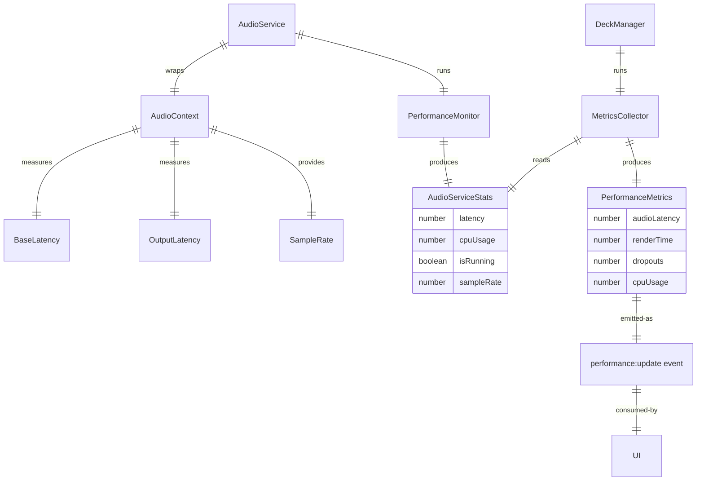

---

## Component-Service Relationships

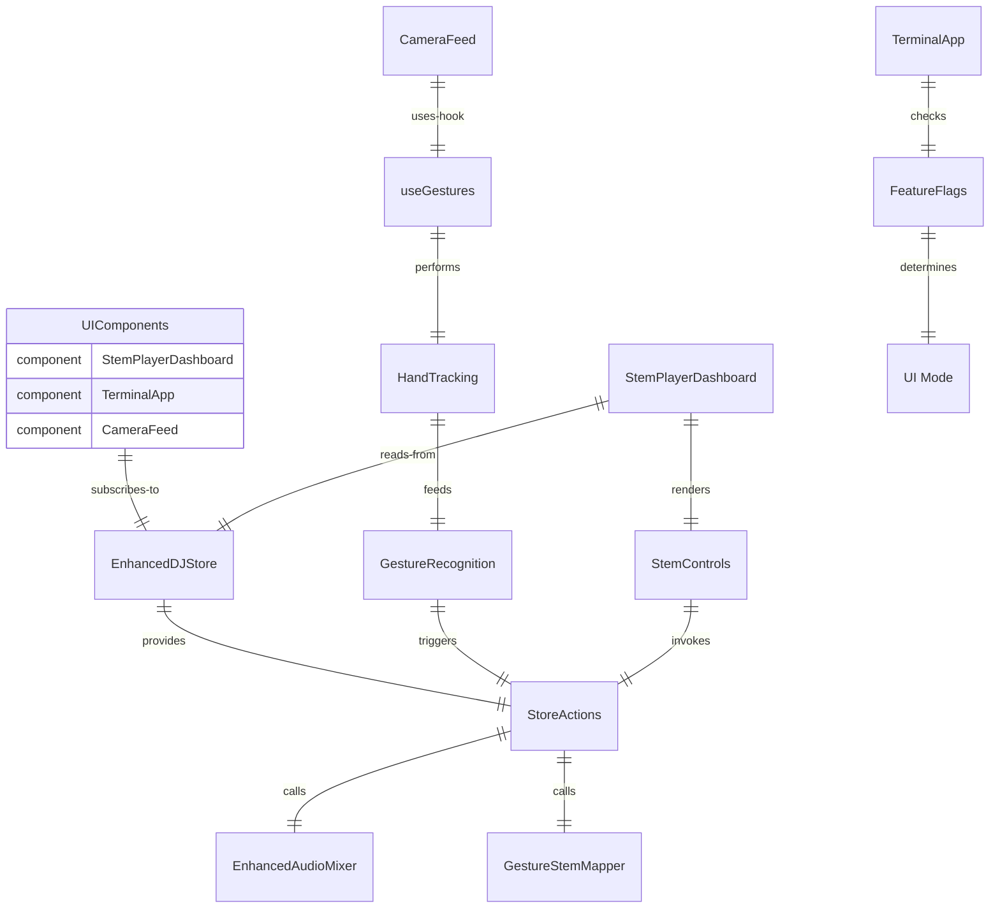

---

## Worker Relationships

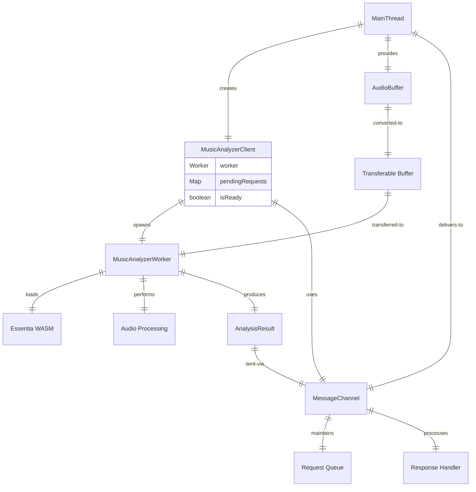

---

## Lifecycle Relationships

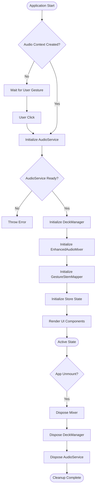

---

## Data Flow: Gesture to Audio

```mermaid
graph LR
    subgraph Input
        Camera[Camera] --> MediaPipe[MediaPipe]
    end

    subgraph Processing
        MediaPipe --> HandResult[Hand Result]
        HandResult --> Recognizer[Gesture Recognizer]
        Recognizer --> GestureResult[Gesture Result]
        GestureResult --> Mapper[Gesture Mapper]
        Mapper --> Mapping[Find Mapping]
    end

    subgraph State
        Mapping --> StoreAction[Store Action]
        StoreAction --> StoreUpdate[Update State]
    end

    subgraph Audio
        StoreUpdate --> MixerCall[Mixer Method Call]
        MixerCall --> StemControl[Stem Control Update]
        StemControl --> AudioParam[Audio Parameter]
        AudioParam --> Sound[Audio Output]
    end

    style Camera fill:#4CAF50
    style Sound fill:#2196F3
```

---

## Dependency Graph

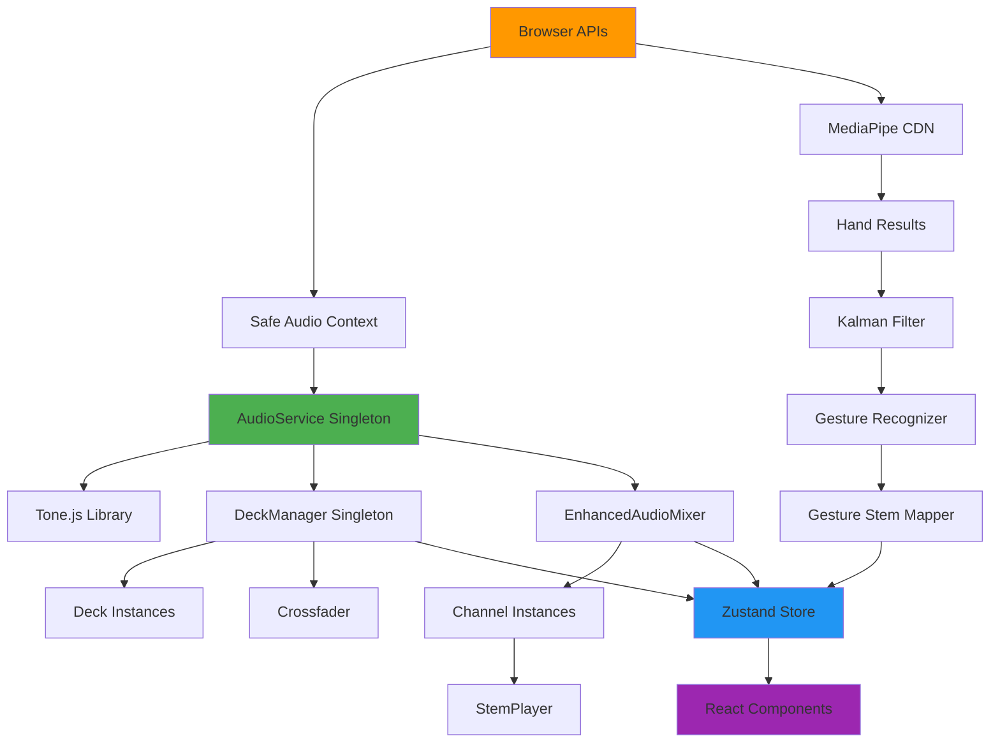

---

## Cardinality Summary

| Relationship                       | Type           | Cardinality | Constraint               |
| ---------------------------------- | -------------- | ----------- | ------------------------ |
| AudioService → DeckManager         | Composition    | 1:1         | Singleton pair           |
| DeckManager → Deck                 | Composition    | 1:2         | Exactly 2 decks (A, B)   |
| EnhancedAudioMixer → Channel       | Composition    | 1:4         | Exactly 4 channels       |
| Channel → StemPlayer               | Aggregation    | 1:0..1      | Optional per channel     |
| StemPlayer → Stem Instance         | Composition    | 1:5         | 5 stems (4 + original)   |
| MappingProfile → GestureMapping    | Composition    | 1:\*        | Variable mappings        |
| GestureStemMapper → MappingProfile | Aggregation    | 1:\*        | Multiple profiles        |
| Deck → Track                       | Aggregation    | 1:0..1      | Optional track loaded    |
| Track → DemucsOutput               | Aggregation    | 1:0..1      | Optional stem data       |
| HandResult → GestureResult         | Transformation | 1:0..\*     | 0-many gestures per hand |
| GestureResult → StoreAction        | Trigger        | 1:0..1      | May or may not trigger   |

---

## Key Relationship Patterns

### 1. Singleton Pattern

- **AudioService** ↔ **DeckManager**: One-to-one singleton pair
- Both must exist for application to function
- Lifecycle managed together

### 2. Factory Pattern

- **AudioService** creates audio nodes (Gain, EQ3, Filter, etc.)
- Ensures consistent configuration
- Manages resource lifecycle

### 3. Event Emitter Pattern

- **DeckManager** emits events (play, pause, sync, etc.)
- Loose coupling between audio engine and UI
- Allows multiple subscribers

### 4. Observer Pattern

- **Zustand Store** observes state changes
- React components subscribe to slices
- Automatic re-render on updates

### 5. Strategy Pattern

- **Crossfader curves**: Linear, Constant-Power, Exponential
- **Gesture mapping modes**: Continuous, Toggle, Trigger
- Runtime selection of algorithm

### 6. Mediator Pattern

- **EnhancedDJStore** mediates between:
  - UI Components
  - Audio Services
  - Gesture Mappers
- Centralized state coordination

---

## Relationship Metrics

| Metric                     | Count |
| -------------------------- | ----- |
| Total Entity Types         | 45    |
| Core Domain Entities       | 25    |
| Supporting Entities        | 20    |
| One-to-One Relationships   | 12    |
| One-to-Many Relationships  | 18    |
| Many-to-Many Relationships | 3     |
| Composition Relationships  | 22    |
| Aggregation Relationships  | 15    |
| Dependency Relationships   | 31    |

---

_Last Updated: 2025-10-09_
_Total Relationships Mapped: 68_
_Diagrams: 10 ER and flow diagrams_
