# Domain Workflows

## Overview

This document describes key workflows and process flows in the OX Board system using Mermaid diagrams.

---

## 1. Audio Initialization Workflow

### Sequence Diagram

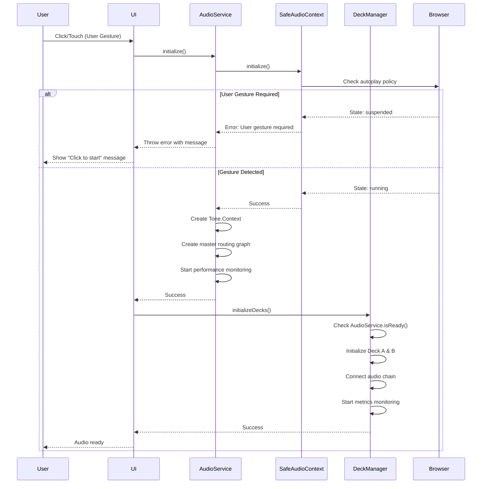

### Critical Path

1. **User Gesture** → Mandatory browser requirement
2. **AudioService Init** → Creates single shared context
3. **DeckManager Init** → Must wait for AudioService
4. **Audio Chain Connection** → Routing established
5. **Monitoring Start** → Performance tracking begins

**Total Time**: ~50-100ms from user gesture to audio ready

---

## 2. Track Loading & Playback Workflow

### State Machine

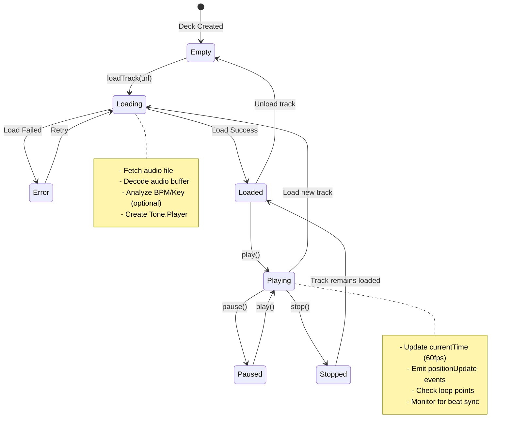

### Sequence for Track Load

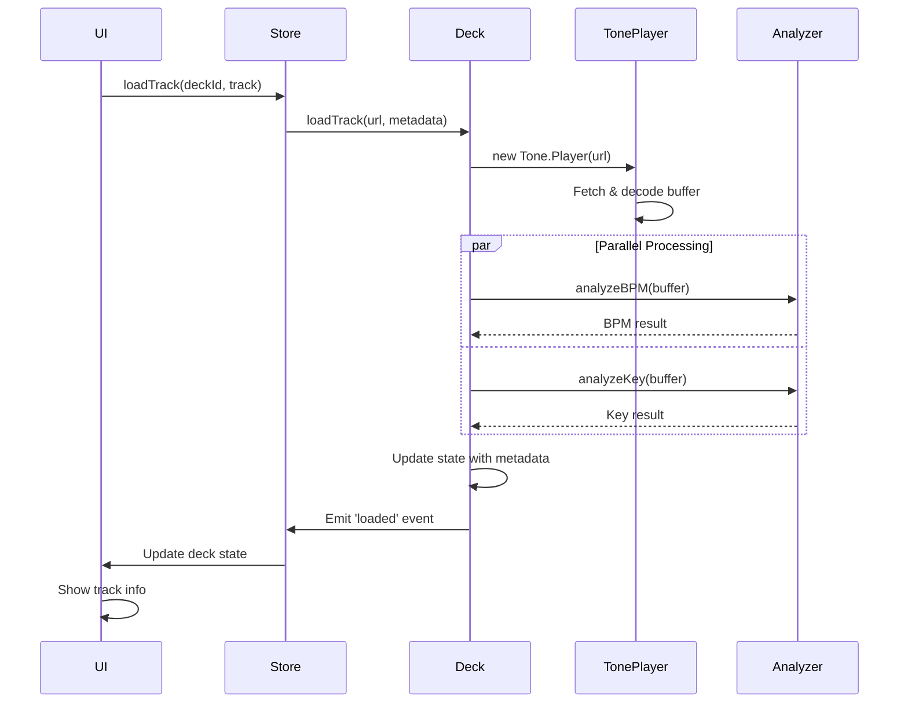

---

## 3. Stem Separation & Loading Workflow

### Flow Diagram

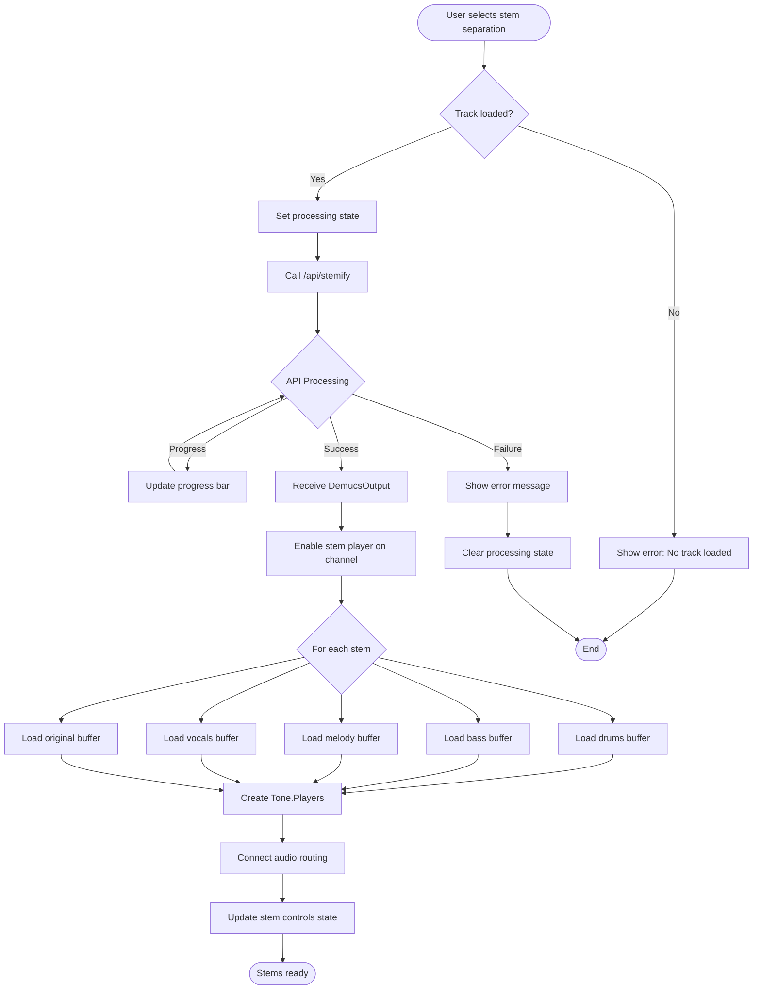

### Stem Player Audio Chain

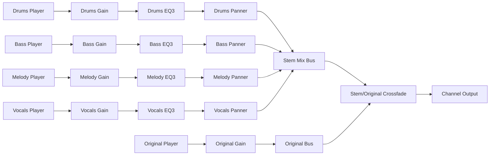

---

## 4. Gesture Recognition Pipeline

### Data Flow

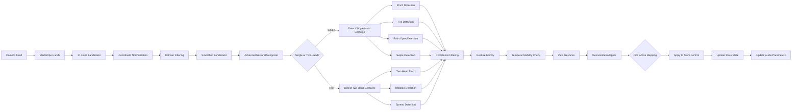

### Gesture Processing Timeline

```mermaid
gantt
    title Gesture-to-Audio Latency Breakdown (Target: 50ms)
    dateFormat X
    axisFormat %L ms

    section Capture
    Camera Frame Capture: 0, 16

    section Detection
    MediaPipe Hand Detection: 16, 32

    section Recognition
    Coordinate Normalization: 32, 35
    Kalman Filtering: 35, 38
    Gesture Classification: 38, 45

    section Mapping
    Find Active Mapping: 45, 47
    Calculate Control Value: 47, 49

    section Application
    Update Store State: 49, 50
    Apply Audio Parameter: 50, 52
```

**Total Latency**: ~52ms (within 50ms target for most cases)

---

## 5. Beat Sync Workflow

### Sequence Diagram

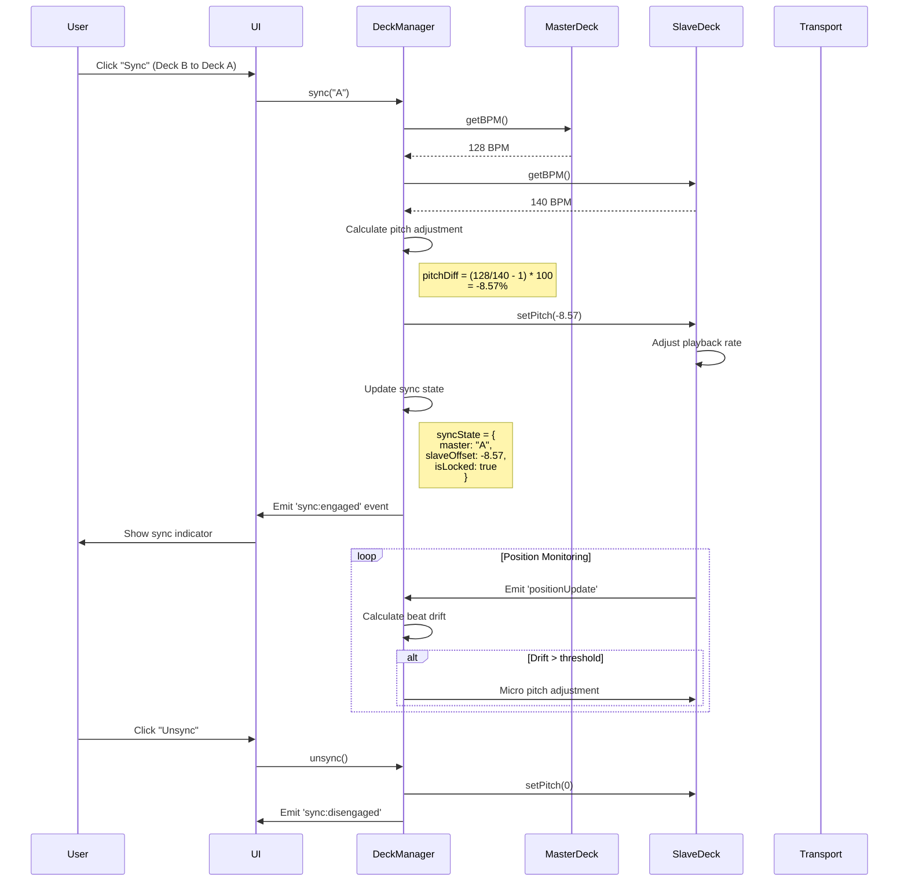

---

## 6. Recording Workflow

### State Machine

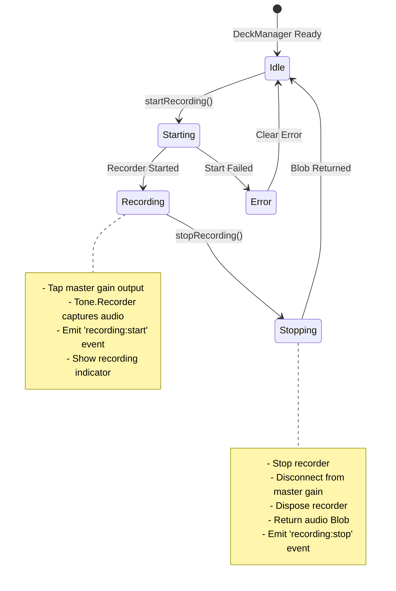

---

## 7. Crossfader Routing Workflow

### Audio Routing Diagram

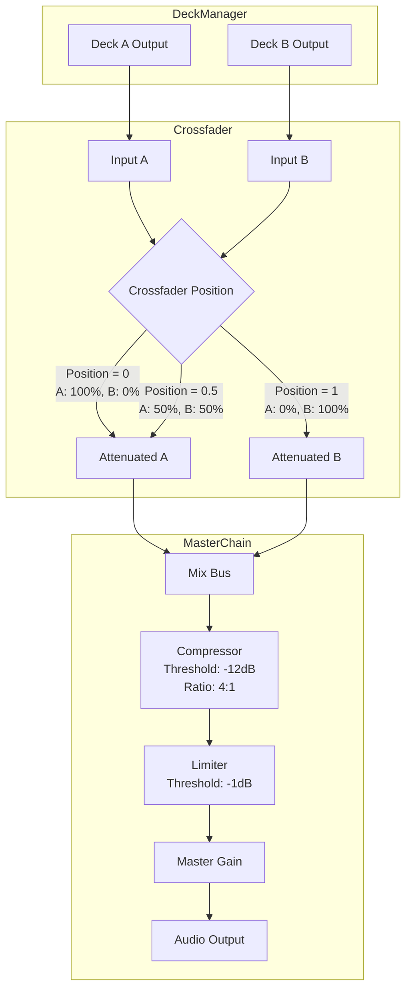

### Crossfader Position Mapping

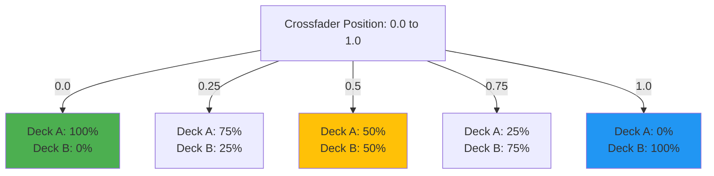

---

## 8. Performance Monitoring Workflow

### Data Collection Flow

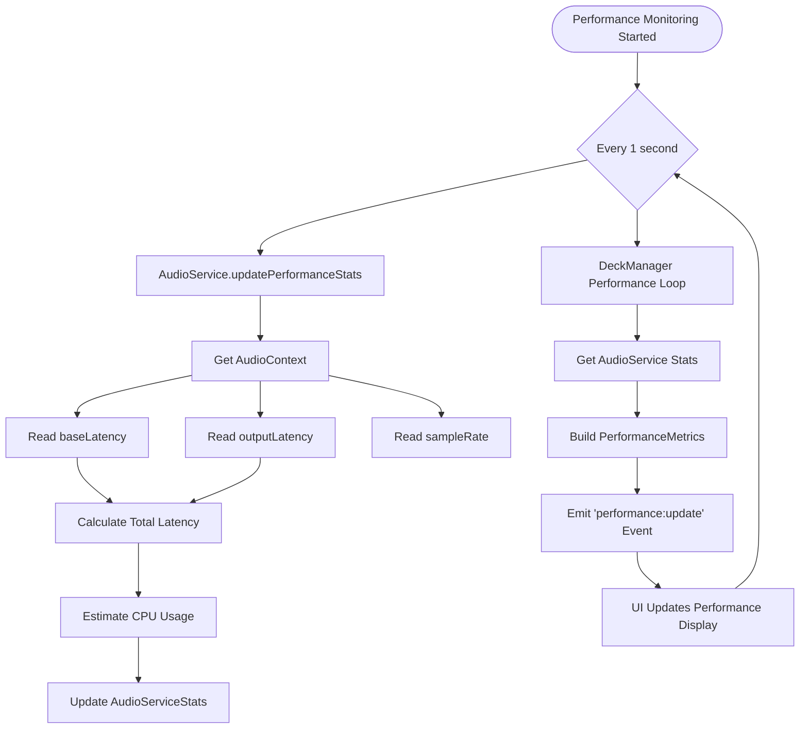

### Metrics Dashboard Data Flow

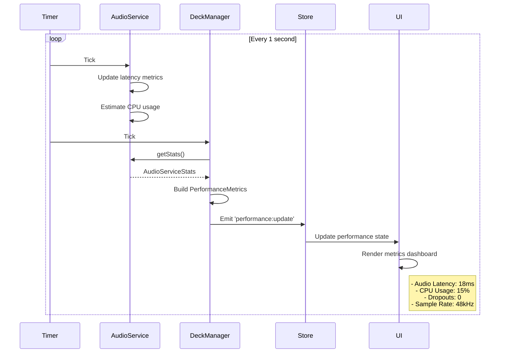

---

## 9. Error Handling Flow

### Error Propagation Strategy

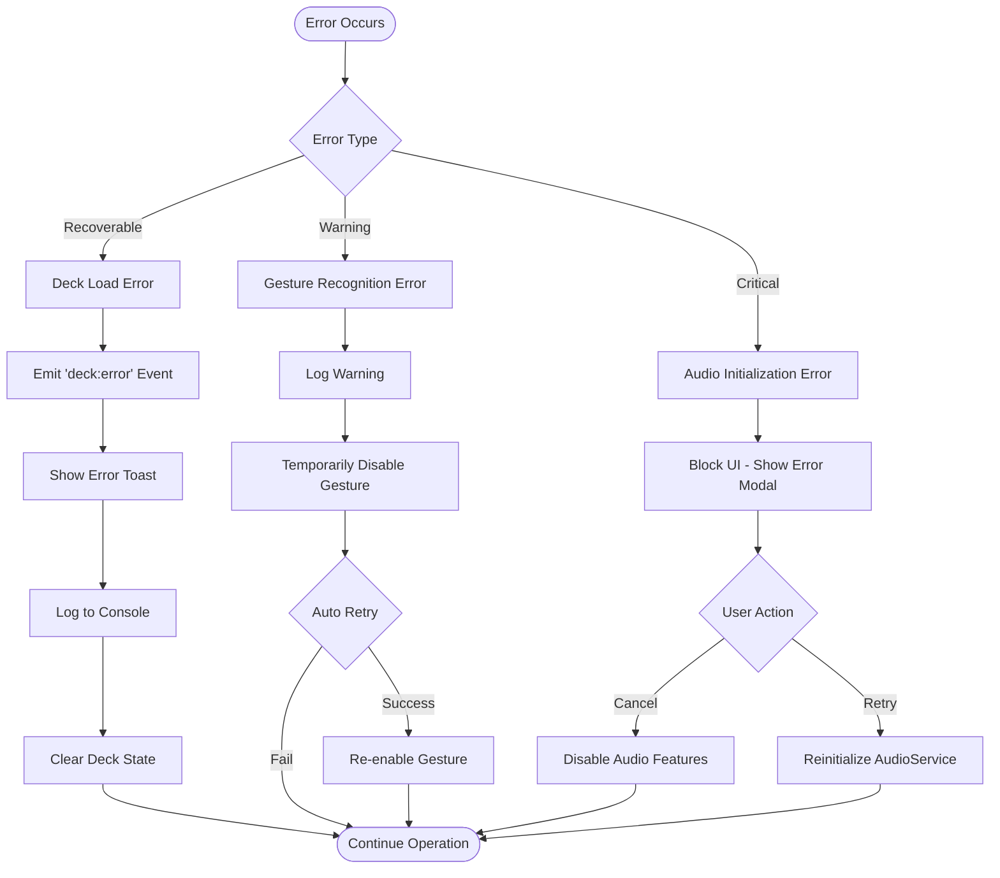

---

## 10. Multi-Channel Stem Mixing Workflow

### 4-Channel Mixer Architecture

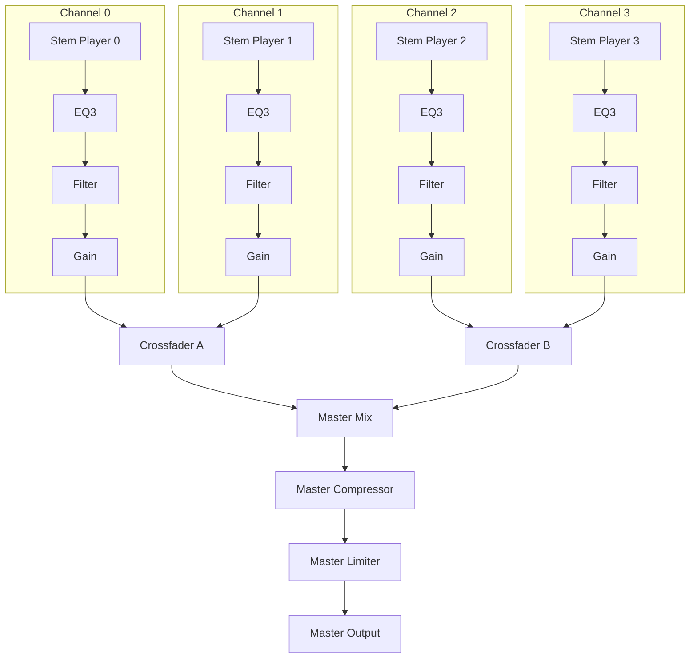

---

## Workflow Metrics Summary

| Workflow               | Average Duration | Critical Path Steps | Error Handling              |
| ---------------------- | ---------------- | ------------------- | --------------------------- |
| Audio Initialization   | 50-100ms         | 5                   | Critical - blocking         |
| Track Loading          | 500ms-2s         | 4                   | Recoverable - retry         |
| Stem Separation        | 10-30s           | 7                   | Recoverable - show progress |
| Gesture Recognition    | 16-52ms          | 6                   | Graceful - log & continue   |
| Beat Sync              | <100ms           | 4                   | Recoverable - show error    |
| Recording Start        | <50ms            | 3                   | Recoverable - retry         |
| Performance Monitoring | 1s interval      | Continuous          | N/A - metrics only          |

---

_Last Updated: 2025-10-09_
_Total Workflows Documented: 10_
_Diagrams: 15 Mermaid charts_
