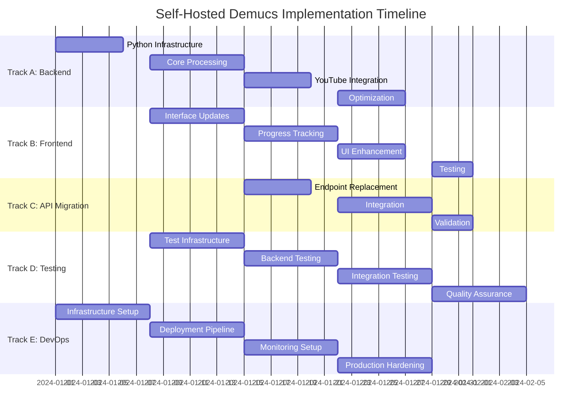
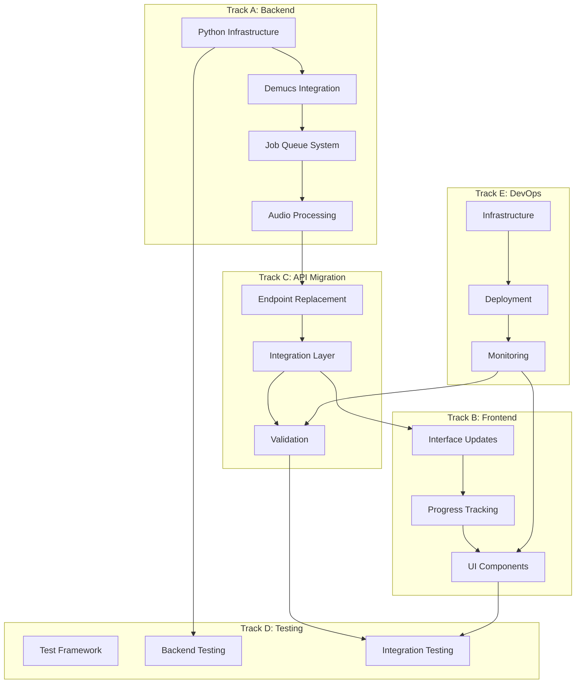
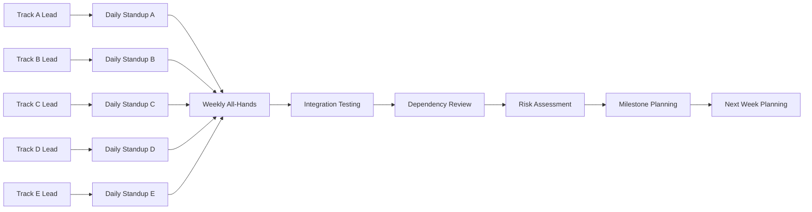

# Self-Hosted Demucs Parallel Execution Strategy

## Executive Summary

This document outlines a comprehensive parallel execution strategy for replacing mock stem separation implementations with production-ready self-hosted Demucs backend. The strategy organizes work into five parallel tracks with defined dependencies, team structure, and execution timeline to minimize development time while ensuring quality and reliability.

**Total Timeline**: 8 weeks  
**Team Size**: 5-7 developers  
**Critical Path**: Backend Infrastructure → Core Processing → Frontend Integration → Testing & Validation

## 1. Dependency Analysis

### Current Mock Implementation Dependencies

**Critical Mock Components (100% Implementation Required):**

- `/api/stemify` - Returns silent audio URLs instead of real stems
- `DemucsProcessor.processStemSeparation()` - Frequency simulation only
- `/api/silent-audio` - Generates silent WAV files for demo
- Frontend service layer expects immediate synchronous responses

**Partial Mock Dependencies:**

- Waveform generation (algorithmic vs. real audio analysis)
- Progress tracking (fake progress vs. real job status)
- Error handling (generic errors vs. audio-specific failures)

### Sequential Dependencies (Must Be Done in Order)

**Phase 1: Foundation (Week 1)**

1. Backend infrastructure setup (Python, FastAPI, dependencies)
2. Basic Demucs model installation and configuration
3. Redis job queue implementation
4. Core file upload processing

**Phase 2: Core Processing (Week 2-3)**

1. YouTube download service implementation
2. Audio processing pipeline completion
3. Model selection and optimization
4. Job status tracking system

**Phase 3: Integration (Week 4-5)**

1. Frontend API service updates
2. Progress polling implementation
3. Error handling integration
4. Real-time UI updates

### Parallel Work Opportunities

**Independent Workstreams:**

- Backend service development (Track A)
- Frontend component updates (Track B)
- Testing infrastructure (Track D)
- DevOps and deployment (Track E)
- Documentation and contracts (can start immediately)

**Shared Resources with Low Conflict:**

- API endpoint definitions (used by both backend and frontend)
- Data models (shared between all components)
- Test scenarios (used across all tracks)

## 2. Parallel Workstreams

### Track A: Backend Infrastructure (Python/FastAPI/Demucs Setup)

**Focus**: Core processing engine and API foundation
**Dependencies**: None (can start immediately)

**Week 1 Tasks:**

- Set up Python backend project structure
- Install and configure Demucs dependencies
- Implement basic FastAPI application
- Set up core configuration management

**Week 2 Tasks:**

- Implement Demucs model loading and initialization
- Create basic file upload processing
- Add Redis job queue integration
- Implement basic job status tracking

**Week 3 Tasks:**

- Add YouTube download service
- Implement audio file validation
- Add model selection options
- Basic error handling and logging

**Week 4 Tasks:**

- Performance optimization
- GPU acceleration setup
- Batch processing capabilities
- Security hardening

### Track B: Frontend Integration (React Component Updates)

**Focus**: Update existing React components for real backend
**Dependencies**: Track A API contract completion

**Week 1 Tasks:**

- Analyze current mock implementation usage
- Update TypeScript interfaces for async processing
- Modify existing service layer for job-based processing
- Update component state management

**Week 2 Tasks:**

- Implement progress polling hooks
- Update upload components for real file handling
- Add YouTube URL processing UI
- Implement job status components

**Week 3 Tasks:**

- Add real-time progress indicators
- Update waveform visualization for real data
- Implement error handling UI
- Add model selection interface

**Week 4 Tasks:**

- Performance optimization
- Accessibility improvements
- Mobile responsiveness updates
- User experience enhancements

### Track C: API Migration (Replace Mock Endpoints)

**Focus**: Systematic replacement of mock endpoints
**Dependencies**: Track A completion, Track B interface updates

**Week 2 Tasks:**

- Replace `/api/stemify` endpoint
- Implement `/api/jobs/{id}` status endpoint
- Add file upload validation
- Update error response formats

**Week 3 Tasks:**

- Add YouTube URL processing endpoint
- Implement job cancellation endpoints
- Add batch processing endpoints
- Update CORS and security headers

**Week 4 Tasks:**

- Performance monitoring endpoints
- Health check endpoints
- Metrics collection endpoints
- API documentation updates

### Track D: Testing Infrastructure (Test Environments)

**Focus**: Comprehensive testing across all components
**Dependencies**: Track A and B interface completion

**Week 1 Tasks:**

- Set up Python testing framework
- Create audio processing test utilities
- Implement mock services for testing
- Set up CI/CD pipeline

**Week 2 Tasks:**

- Write unit tests for backend services
- Create integration tests for API endpoints
- Implement audio quality validation tests
- Add performance benchmarking

**Week 3 Tasks:**

- Frontend component testing
- End-to-end integration tests
- Load testing for concurrent processing
- Audio quality assessment tests

**Week 4 Tasks:**

- Security testing
- Accessibility testing
- Cross-browser compatibility
- Mobile device testing

### Track E: DevOps & Deployment (CI/CD, Monitoring, Infrastructure)

**Focus**: Production infrastructure and operations
**Dependencies**: Track A core functionality

**Week 1 Tasks:**

- Set up GPU-enabled server infrastructure
- Configure Docker containers
- Set up Redis and database services
- Implement basic monitoring

**Week 2 Tasks:**

- CDN configuration for audio delivery
- Load balancer setup
- Backup and recovery procedures
- Security hardening

**Week 3 Tasks:**

- Performance monitoring and alerting
- Log aggregation and analysis
- Automated deployment pipelines
- Scaling configuration

**Week 4 Tasks:**

- Production security audit
- Performance optimization
- Cost monitoring and optimization
- Documentation completion

## 3. Team Structure

### Recommended Team Composition (5-7 Developers)

**Backend Developer (Python/FastAPI) - 2 developers**

- **Skills Required**: Python, FastAPI, PyTorch, audio processing, Redis
- **Responsibilities**: Core backend infrastructure, Demucs integration, job queue
- **Track Focus**: Track A (Primary), Track C (Secondary)

**Frontend Developer (React/TypeScript) - 2 developers**

- **Skills Required**: React, TypeScript, state management, Web Audio API
- **Responsibilities**: Frontend integration, UI updates, real-time features
- **Track Focus**: Track B (Primary), Track C (Secondary)

**Full-Stack Developer - 1 developer**

- **Skills Required**: Both backend and frontend skills, API design
- **Responsibilities**: API migration, integration testing, coordination
- **Track Focus**: Track C (Primary), Track A/B (Secondary)

**DevOps Engineer - 1 developer**

- **Skills Required**: Docker, Kubernetes, monitoring, cloud infrastructure
- **Responsibilities**: Infrastructure setup, deployment, monitoring
- **Track Focus**: Track E (Primary), Track D (Secondary)

**QA/Test Engineer - 1 developer** (Optional)

- **Skills Required**: Testing frameworks, audio quality assessment, automation
- **Responsibilities**: Testing infrastructure, quality validation
- **Track Focus**: Track D (Primary), All tracks (Secondary)

### Skill Set Requirements by Track

**Track A (Backend Infrastructure):**

- Advanced Python development
- Audio processing with PyTorch/Torchaudio
- FastAPI and async programming
- Redis and job queue systems
- GPU computing (preferred)

**Track B (Frontend Integration):**

- React and TypeScript expertise
- State management (Zustand)
- Web Audio API integration
- Real-time UI updates
- Progressive Web App features

**Track C (API Migration):**

- RESTful API design
- Both Python and TypeScript
- Database design and optimization
- Security best practices
- Integration testing

**Track D (Testing Infrastructure):**

- Test automation frameworks
- Audio quality assessment
- Performance testing
- CI/CD pipeline management
- Security testing

**Track E (DevOps & Deployment):**

- Container orchestration
- Cloud infrastructure management
- Monitoring and logging
- Security hardening
- Performance optimization

## 4. Execution Timeline

### Week-by-Week Schedule



### Dependency Checkpoints

**Week 1 Checkpoint (Day 5):**

- Track A: Basic backend infrastructure operational
- Track E: Development environment ready
- Track D: Basic testing framework setup

**Week 2 Checkpoint (Day 12):**

- Track A: Core processing functional for uploaded files
- Track B: Frontend interfaces updated for async processing
- Track E: Staging environment configured

**Week 3 Checkpoint (Day 19):**

- Track A: YouTube integration complete
- Track C: API endpoints operational
- Track B: Progress tracking UI functional

**Week 4 Checkpoint (Day 26):**

- All tracks: Core functionality integration tested
- Track D: Comprehensive test coverage achieved
- Track E: Production environment ready

### Integration Milestones

**Milestone 1: Core Processing (End of Week 2)**

- Real stem separation working for file uploads
- Basic progress tracking operational
- Frontend can display real processing status

**Milestone 2: YouTube Integration (End of Week 3)**

- YouTube URL processing functional
- All API endpoints operational
- Real-time progress updates working

**Milestone 3: Production Ready (End of Week 4)**

- All features fully integrated and tested
- Performance optimization complete
- Production deployment ready

## 5. Task Assignments

### Track A: Backend Infrastructure Tasks

**High Priority (P0) - 45 developer-days**

- Set up Python project structure and dependencies (3 days)
- Configure Demucs model loading and initialization (5 days)
- Implement Redis job queue system (4 days)
- Create file upload and validation (3 days)
- Implement YouTube download service (5 days)
- Add audio processing pipeline (7 days)
- Performance optimization and GPU setup (8 days)
- Security hardening and rate limiting (6 days)
- Comprehensive error handling (4 days)

**Medium Priority (P1) - 25 developer-days**

- Model selection and configuration (4 days)
- Batch processing capabilities (5 days)
- Caching implementation (3 days)
- Health check endpoints (2 days)
- Metrics collection (4 days)
- Documentation (7 days)

### Track B: Frontend Integration Tasks

**High Priority (P0) - 35 developer-days**

- Update TypeScript interfaces for async processing (3 days)
- Modify service layer for job-based operations (4 days)
- Implement progress polling hooks (5 days)
- Update upload components for real processing (4 days)
- Add YouTube URL processing interface (3 days)
- Implement real-time progress indicators (5 days)
- Update error handling UI (4 days)
- Performance optimization (7 days)

**Medium Priority (P1) - 20 developer-days**

- Accessibility improvements (4 days)
- Mobile responsiveness updates (3 days)
- Enhanced user experience features (5 days)
- Progressive Web App enhancements (3 days)
- Offline capability improvements (5 days)

### Track C: API Migration Tasks

**High Priority (P0) - 25 developer-days**

- Replace `/api/stemify` endpoint (4 days)
- Implement `/api/jobs/{id}` status endpoint (3 days)
- Add file upload validation middleware (3 days)
- Update CORS and security configurations (2 days)
- YouTube URL processing endpoint (4 days)
- Job cancellation and management (3 days)
- Error response standardization (3 days)
- API documentation updates (3 days)

**Medium Priority (P1) - 15 developer-days**

- Performance monitoring endpoints (3 days)
- Health check implementation (2 days)
- Metrics collection endpoints (3 days)
- Rate limiting implementation (3 days)
- Request/response logging (4 days)

### Track D: Testing Infrastructure Tasks

**High Priority (P0) - 40 developer-days**

- Set up Python testing framework and utilities (4 days)
- Create audio processing test scenarios (5 days)
- Backend service unit tests (6 days)
- API endpoint integration tests (5 days)
- Frontend component testing (4 days)
- End-to-end integration tests (6 days)
- Performance benchmarking setup (5 days)
- Audio quality validation framework (5 days)

**Medium Priority (P1) - 25 developer-days**

- Load testing for concurrent processing (6 days)
- Security testing framework (4 days)
- Cross-browser compatibility testing (3 days)
- Mobile device testing (4 days)
- Accessibility testing (3 days)
- Regression testing automation (5 days)

### Track E: DevOps & Deployment Tasks

**High Priority (P0) - 35 developer-days**

- GPU-enabled server infrastructure setup (5 days)
- Docker container configuration (4 days)
- Redis and database service setup (3 days)
- Basic monitoring implementation (4 days)
- CDN configuration for audio delivery (4 days)
- Load balancer and scaling setup (5 days)
- Backup and recovery procedures (4 days)
- Security hardening (6 days)

**Medium Priority (P1) - 20 developer-days**

- Performance monitoring and alerting (5 days)
- Log aggregation system (3 days)
- Automated deployment pipelines (4 days)
- Production environment optimization (4 days)
- Cost monitoring implementation (4 days)

## 6. Sync Mechanisms

### Daily Standup Structure

**Track A Daily Standup (9:00 AM)**

- 15-minute focused updates
- Blockers and dependencies
- Progress on current tasks
- Next day planning

**Track B Daily Standup (9:30 AM)**

- Frontend-specific challenges
- Integration status with Track A
- UI/UX progress updates
- Cross-track dependencies

**Track C Daily Standup (10:00 AM)**

- API integration status
- Endpoint development progress
- Testing coordination
- Documentation updates

**Track D Daily Standup (10:30 AM)**

- Testing progress and blockers
- Quality metrics updates
- Automation status
- Cross-track testing needs

**Track E Daily Standup (11:00 AM)**

- Infrastructure status
- Deployment progress
- Monitoring and alerts
- Security updates

### Weekly Cross-Track Synchronization

**Weekly All-Hands Meeting (Friday 2:00 PM)**

- 60-minute comprehensive review
- Cross-track dependency status
- Risk assessment and mitigation
- Resource allocation adjustments
- Milestone progress review

**Integration Testing Sessions (Wednesday 10:00 AM)**

- 90-minute focused integration testing
- Cross-track component testing
- API contract validation
- End-to-end workflow testing

### Communication Channels

**Primary Channels:**

- **#demucs-backend**: Track A technical discussions
- **#demucs-frontend**: Track B development updates
- **#demucs-api**: Track C integration topics
- **#demucs-testing**: Track D test coordination
- **#demucs-devops**: Track E infrastructure updates

**Cross-Track Coordination:**

- **#demucs-integration**: Dependency management
- **#demucs-blockers**: Critical issue escalation
- **#demucs-reviews**: Code and design reviews

### Decision Making Process

**Technical Decisions:**

- Architecture changes: Require Track A lead approval + cross-track review
- API contract changes: Require Track C lead approval + all track leads
- Testing strategy changes: Require Track D lead approval + affected tracks

**Priority Changes:**

- Task priority adjustments: Individual track leads can make decisions
- Cross-track priority conflicts: Escalate to project manager
- Resource reallocation: Weekly all-hands consensus required

## 7. Risk Mitigation for Parallel Work

### Code Merge Conflicts

**Mitigation Strategies:**

- **Feature Branching**: Each track maintains separate feature branches
- **Integration Branches**: Weekly integration branches for cross-track testing
- **Conflict Resolution Protocol**:
  1. Automated conflict detection in CI/CD
  2. Track leads collaborate on resolution
  3. All-hands review for complex conflicts
  4. Rollback plan for failed merges

**Prevention Measures:**

- Clear code ownership boundaries
- Regular cross-track code reviews
- Shared component documentation
- Integration testing before merges

### API Contract Mismatches

**Mitigation Strategies:**

- **Contract-First Development**: API contracts defined before implementation
- **Schema Validation**: Automated validation of request/response formats
- **Version Management**: Clear versioning for API changes
- **Backward Compatibility**: Maintain compatibility during transition

**Detection Methods:**

- Automated API testing in CI/CD
- Contract testing before deployment
- Integration testing for all endpoints
- Manual verification during weekly sync

### Resource Contention

**Mitigation Strategies:**

- **Environment Segregation**: Separate dev/staging/prod environments
- **Resource Quotas**: CPU/memory limits per track
- **Scheduling Coordination**: Track E manages shared resource allocation
- **Monitoring**: Real-time resource usage tracking

**Contention Scenarios:**

- GPU resource conflicts: Track A has priority, others use CPU fallback
- Database connections: Connection pooling with limits per track
- File storage: Separate directories per track with quotas
- Network bandwidth: CDN integration for audio file serving

### Testing Bottlenecks

**Mitigation Strategies:**

- **Parallel Test Execution**: Multiple test environments and CI/CD pipelines
- **Test Data Management**: Shared test data repository with versioning
- **Mock Services**: Comprehensive mocks for independent testing
- **Staged Testing**: Unit → Integration → End-to-end progression

**Quality Gates:**

- Code coverage requirements (80%+ for all tracks)
- Performance benchmarks must be met
- Security scanning required before deployment
- Accessibility compliance validation

### Critical Path Dependencies

**Risk Identification:**

- Backend processing must be functional before frontend integration
- API contracts must be stable before client implementation
- Infrastructure must be ready before deployment testing

**Mitigation Approaches:**

- Buffer time in schedule for dependency delays
- Parallel development of dependent components where possible
- Early prototyping of critical path items
- Weekly dependency review and adjustment

## 8. Visual Diagrams

### Critical Path Visualization

```mermaid
graph TD
    A[Backend Infrastructure] --> B[Core Processing]
    B --> C[API Endpoints]
    C --> D[Frontend Integration]
    D --> E[Testing & Validation]
    E --> F[Production Deployment]

    G[DevOps Setup] --> H[Environment Config]
    H --> I[Monitoring Setup]
    I --> F

    J[Testing Framework] --> K[Unit Tests]
    K --> L[Integration Tests]
    L --> E

    Style A fill:#e1f5fe
    Style B fill:#fff3e0
    Style C fill:#f3e5f5
    Style G fill:#e8f5e8
    Style J fill:#fce4ec
```

### Dependency Graph Between Workstreams



### Team Communication Flow



This parallel execution strategy provides a comprehensive framework for multiple teams to work simultaneously on replacing mock stem separation with production-ready self-hosted Demucs functionality. The strategy minimizes development time through careful dependency management, clear communication channels, and robust risk mitigation approaches.

**Key Success Factors:**

1. Maintain clear separation of concerns between tracks
2. Regular integration testing and dependency validation
3. Proactive risk identification and mitigation
4. Flexible resource allocation based on progress
5. Continuous communication and coordination

**Estimated Timeline:** 8 weeks for complete implementation with parallel execution across all tracks.
